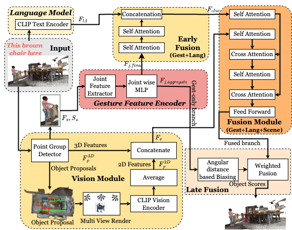

# Ges3ViG

<a href="https://pytorch.org/"></a>
<a href="https://pytorchlightning.ai/"></a>
<a href="https://wandb.ai/site"></a>

This is the official implementation for **Ges3ViG: Incorporating Pointing Gestures into Language-Based 3D Visual Grounding for Embodied Reference Understanding.**



## Requirement
This repo contains [CUDA](https://developer.nvidia.com/cuda-zone) implementation, please make sure your [GPU compute capability](https://developer.nvidia.com/cuda-gpus) is at least 3.0 or above.


## Setup
### Conda (recommended)
We recommend the use of [miniconda](https://docs.conda.io/en/latest/miniconda.html) to manage system dependencies.

```shell
# create and activate the conda environment
conda create -n ges3vig python=3.10
conda activate ges3vig

# install PyTorch 2.0.1
conda install pytorch torchvision pytorch-cuda=11.7 -c pytorch -c nvidia

# install PyTorch3D with dependencies
conda install -c fvcore -c iopath -c conda-forge fvcore iopath
conda install pytorch3d -c pytorch3d

# install MinkowskiEngine with dependencies
conda install -c anaconda openblas
pip install -U git+https://github.com/NVIDIA/MinkowskiEngine -v --no-deps \
--install-option="--blas_include_dirs=${CONDA_PREFIX}/include" --install-option="--blas=openblas"

# install Python libraries
pip install .

# install CUDA extensions
cd ges3vig/common_ops
pip install .
```

### Pip
Note: Setting up with pip (no conda) requires [OpenBLAS](https://github.com/xianyi/OpenBLAS) to be pre-installed in your system.
```shell
# create and activate the virtual environment
virtualenv env
source env/bin/activate

# install PyTorch 2.0.1
pip install torch torchvision

# install PyTorch3D
pip install pytorch3d

# install MinkowskiEngine
pip install MinkowskiEngine

# install Python libraries
pip install .

# install CUDA extensions
cd ges3vig/common_ops
pip install .
```

## Data Preparation
Note: ImputeRefer dataset requires the [ScanNet v2](http://www.scan-net.org/) dataset. Please preprocess it first.


<!-- ### Preprocessed ScanNet v2 and Preprocessed Imputed Scannet v2
1. Download the [Preprocessed Imputed ScanNet v2 dataset (train/val)](https://drive.google.com/drive/u/2/folders/15FKrxOVmSFk9hxlMDFHx-bf0VoVzTgNl), and [Preprocessed ScanNet original train-set](https://drive.google.com/file/d/114y3GHtD8M-1DoYn3RD8PxLldBpbYiIl/view?usp=drive_link). The raw dataset files should be organized as follows:
    ```shell
    ges3vig # project root
    ├── dataset
    │   ├── scannetv2
    │   │   ├── train.zip
    │   │   ├── test.zip
    │   │   ├── val.zip
    │   │   ├── train_imputed_newer.zip
    │   │   ├── val_imputed_newer.zip
    │   │   ├── points.zip
    │   │   ├── val_imputed_newer.zip
    │   │   ├── translated_transforms_v2.zip
    ```
    Then use
    ```shell
    unzip *.zip
    ```
    Here train, test, val.zip contain preprocessed .pth files for original ScanNet-V2 dataset while train_imputed_newer, val_imputed_newer.zip contain modified .pth for imputed version of ScanNet-V2. 
    The file points.zip contains the bounding box-corner coordinates for every object per scene and some additional meta-data and file translated_transforms_v2.zip contains .pth files containing translation and rotation data for the singular human subject we have given by imputer. -->
### ScanNet v2 dataset
1. Download the [ScanNet v2 dataset (train/val/test)](http://www.scan-net.org/), (refer to [ScanNet's instruction](dataset/scannetv2/README.md) for more details). The raw dataset files should be organized as follows:
    ```shell
    ges3vig # project root
    ├── dataset
    │   ├── scannetv2
    │   │   ├── scans
    │   │   │   ├── [scene_id]
    │   │   │   │   ├── [scene_id]_vh_clean_2.ply
    │   │   │   │   ├── [scene_id]_vh_clean_2.0.010000.segs.json
    │   │   │   │   ├── [scene_id].aggregation.json
    │   │   │   │   ├── [scene_id].txt
    ```

2. Pre-process the data, it converts original meshes and annotations to `.pth` data:
    ```shell
    python dataset/scannetv2/preprocess_all_data.py data=scannetv2 +workers={cpu_count}
    ```

<!-- 3. Pre-process the multiview features from ENet: Please refer to the instructions in [ScanRefer's repo](https://github.com/daveredrum/ScanRefer#data-preparation) with one modification:
   - comment out lines 51 to 56 in [batch_load_scannet_data.py](https://github.com/daveredrum/ScanRefer/blob/master/data/scannet/batch_load_scannet_data.py#L51-L56) since we follow D3Net's setting that doesn't do point downsampling here.

   Then put the generated `enet_feats_maxpool.hdf5` (116GB) under `m3drefclip/dataset/scannetv2` -->

### Human Augmenting the ScanNet v2 dataset
1. Download the [Human Pose Data](https://drive.google.com/drive/folders/1cVHuwIzxPwFNQBF2nK6zNTyQZPhsGk4O?usp=sharing) and the [Human Models](https://drive.google.com/file/d/147uXqfSrqgCvuusCNUTk-fJflzgR-bDu/view?usp=sharing).
2. Unzip the zip files and arrange the data in accordance to the following folder structure:
    ```shell
    ges3vig # project root
    ├── dataset
    │   ├── humans
    │   │   ├── man_tall_white
    │   │   ├── man_medium_white
    │   │   ├── woman_medium_white
    │   │   ├── woman_tall_white
    |   |   ...    
    │   ├── scannetv2
    │   │   ├── scans
    │   │   ├── human_info_train
    │   │   ├── human_info_test
    ```
3. Augment the information by running the following command in the project root"
    ```shell
    python dataset/scannetv2/preprocess_all_imputed_data_add_scans.py +split={split}
    ```
    This should populate the folders `{split}_imputed` with the relevant `.pth` files

### Generating Human Position data using Imputer
1. Install Imputer by running the following the project root:
```shell
    cd Imputer
    pip install -e .
    cd ..
```
This will compile utilities essential for Imputer to run on GPU.

2. Edit the target folder location in `config/data/human.yaml` to set the `imputer_target_dir` field. This sets the target folder where the imputer will save the imputed human positions.

3. Run imputer using the following command:
```shell
python3 dataset/scannetv2/imputer_full.py data=imputerefer
```

4. Run the following command block to populate `{split}_imputed` with the final processed dataset
```shell
python3 dataset/scannetv2/preprocess_all_imputed_data.py data=imputerefer
```


### ImputeRefer Ground Truth and Language Descriptions 
1. Download the [ImputeRefer ground truth and language descriptions (train/test)](https://drive.google.com/drive/folders/1MtWnlox42HUcYzlBwe-mA-ceiijnVBy0?usp=sharing). The raw dataset files should be organized as follows:
    ```shell
    ges3vig # project root
    ├── dataset
    │   ├── imputerefer
    │   │   ├── metadata
    │   │   │   ├── ImputeRefer_filtered_train.json
    │   │   │   ├── ImputeRefer_filtered_test.json
    ```

2. Pre-process the data, "unique/multiple" labels will be added to raw `.json` files for evaluation purpose:
    ```shell
    python dataset/scanrefer/add_evaluation_labels.py data=imputerefer
    ```


### Pre-trained detector
We pre-trained [PointGroup](https://arxiv.org/abs/2004.01658) implemented in [MINSU3D](https://github.com/3dlg-hcvc/minsu3d/) on Imputed [ScanNet v2](http://www.scan-net.org/) scenes and use it as the detector. We use coordinates + colors + multi-view features as inputs.
1. Download the [pre-trained detector](https://drive.google.com/file/d/1yqhUMg5d4dh60dLDv4mf_RF4HXBo2T-Y/view?usp=sharing). The detector checkpoint file should be organized as follows:
    ```shell
    ges3vig # project root
    ├── checkpoints
    │   ├── PointGroup_ScanNet.ckpt
    ```

## Training, Inference and Evaluation
Note: Configuration files are managed by [Hydra](https://hydra.cc/), you can easily add or override any configuration attributes by passing them as arguments.
```shell
wandb login

# train a model with the pre-trained detector, using predicted object proposals for imputed data
python train.py data=imputerefer experiment_name={any_string}


# train a model with the pre-trained detector, using predicted object proposals
python train.py data=imputerefer experiment_name={any_string} +detector_path=checkpoints/PointGroup_ScanNet.ckpt


# train a model from a checkpoint, it restores all hyperparameters in the .ckpt file for imputed data
python train.py data=imputedrefer experiment_name={checkpoint_experiment_name} ckpt_path={ckpt_file_path} #is suggested

# test a model from a checkpoint and save its predictions for imputed data
python test.py data=imputerefer data.inference.split={train/val/test} ckpt_path={ckpt_file_path} pred_path={predictions_path}
```
## Checkpoints
### ImputeRefer dataset
[Ges3ViG_ImputeRefer.ckpt](https://drive.google.com/file/d/1t4qfz3DBFjwTqHucoe4NS0igavckE-qC/view?usp=sharing)

Performance:

| **Model**                             | **IoU @0.25 (unique)** | **IoU @0.5 (unique)** | **IoU @0.25 (multiple)** | **IoU @0.5 (multiple)** | **IoU @0.25 (overall)** | **IoU @0.5 (overall)** |
|---------------------------------------|-------------------------|-------------------------|---------------------------|---------------------------|---------------------------|---------------------------|
| **Without Gestures:**                 |                         |                         |                           |                           |                           |                           |
| 3DVG-Transformer   | 71.56                  | 50.66                  | 31.35                    | 21.54                    | 39.17                    | 27.20                    |
| HAM                | 67.10                  | 48.13                  | 25.42                    | 16.04                    | 33.51                    | 22.27                    |
| 3DJCG               | 75.93                  | 59.19                  | 40.34                    | 30.61                    | 47.24                    | 36.16                    |
| M3DRefCLIP               | 77.32                  | 60.15                  | 62.62                    | 47.27                    | 65.53                    | 49.78                    |
| **With Gestures:**                    |                         |                         |                           |                           |                           |                           |
| ScanERU              | 71.60                  | 52.79                  | 31.91                    | 23.06                    | 39.54                    | 28.84                    |
| **Ges3ViG**                 | **84.60**              | **71.03**              | **67.57**                | **55.77**                | **70.85**                | **58.71**                |


### Acknowledgements

We would like to acknowledge [M3DRefCLIP](https://github.com/3dlg-hcvc/M3DRef-CLIP) for the 3D Visual Grounding Codebase.
